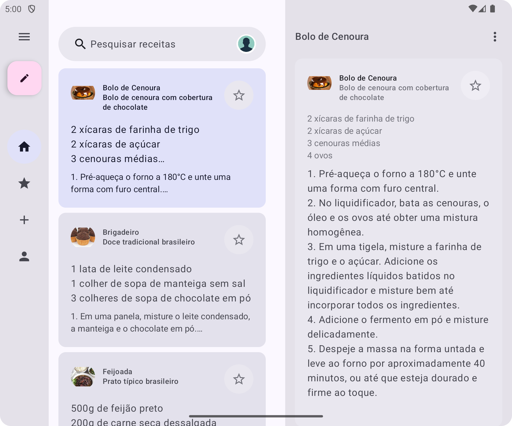
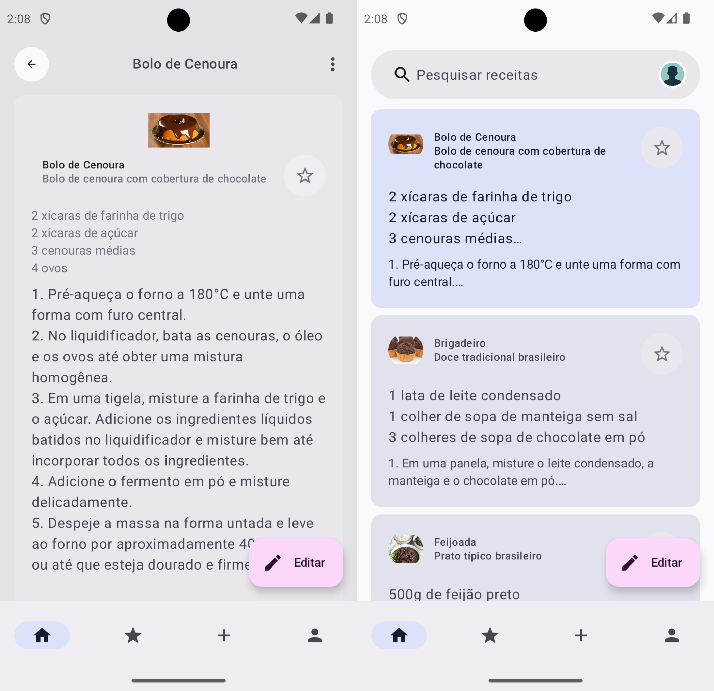

# Minhas Receitas (My Recipes)

Minhas Receitas is a modern Android application that allows users to browse, save, and create recipes. The app leverages artificial intelligence to help users discover and create new recipes based on their preferences and available ingredients.

## About the App

Minhas Receitas is built with [Jetpack Compose][compose] and follows [Material 3 design principles][material3]. It is based on the [Reply sample app](https://github.com/android/compose-samples/tree/main/Reply) and provides a beautiful and intuitive interface for managing your favorite recipes.

Key features:
* Browse a collection of traditional Brazilian recipes
* View detailed ingredients and step-by-step cooking instructions
* AI-powered recipe suggestions based on your preferences
* Create and save your own recipes
* Adaptive UI that works seamlessly on phones, tablets, and foldable devices

## Screenshots

## Technical Features

### AI Integration
The app uses artificial intelligence to:
* Generate new recipe ideas based on a name

### Material 3 Design
Minhas Receitas implements Material 3 design principles with:
* Responsive layouts for different screen sizes
* Smooth animations and transitions

### Adaptive UI
The app provides an optimal experience across different devices:
* Responsive layouts for phones, tablets, and foldable devices
* Dynamic content organization based on screen size
* Support for different navigation patterns depending on device form factor

### Data Management
The app uses a repository pattern for data management:
* Local storage of recipes
* Categorization by recipe type (Main Course, Dessert, Appetizer, etc.)
* Efficient search and filtering capabilities

## Getting Started

To try out this app, use the latest stable version of [Android Studio](https://developer.android.com/studio).
You can clone this repository.

### Firebase Setup

1.  **Create a Firebase Project:**
    *   In the [Firebase console](https://console.firebase.google.com/), click **Add project**, and follow the on-screen instructions to create a Firebase project.

2.  **Register Your App:**
    *   In the project overview page, click the **Android** icon to launch the setup workflow.
    *   Enter the package name of the app: `com.ao.recipes`.
    *   Click **Register app**.

3.  **Add a Firebase Configuration File:**
    *   Click **Download google-services.json** to obtain your Firebase Android config file.
    *   Move the downloaded `google-services.json` file into the `app/` directory of your Android project.

4.  **Enable the Gemini API:**
    *   In the [Google AI Studio](https://aistudio.google.com/app/apikey), create an API key.
    *   In the Firebase console, go to the **Build** > **Gemini API** page and click **Enable**.

[compose]: https://developer.android.com/jetpack/compose
[material3]: https://m3.material.io/
